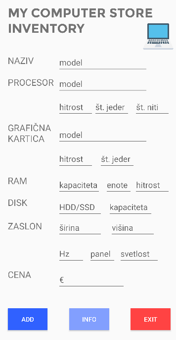
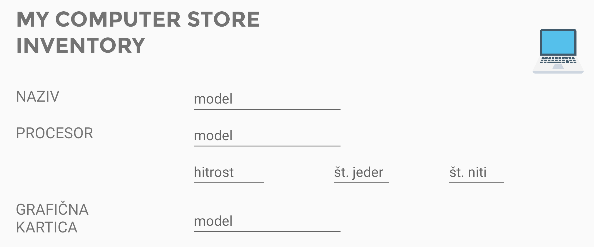

# MOBILNA APLIKACIJA ZA BELEŽENJE SEZNAMA RAČUNALNIKOV

### Aplikacija razvita v Android Studio v jeziku Kotlin.

## MODUL

  
### razred `Computer`
- vsebuje razred `Screen`, `Processor`, `GraphicsCard`, `Ram` & `Storage`
- implementira vmesnik `Comparable`
- vsebuje povoženo metodo `compareTo(other: Computer): Int`, s katero vrnemo 0, 1 ali -1 ob primerjavi 2 računalnikov po njuni ceni
- ter povoženo metodo `toString(): String`, s katero v obliki niza vrnemo vse podrobnosti računalnika

### razred `Screen`
- predstavlja zaslon računalnika
- vsebuje naštevni razred (enum class) `PanelType` za določitev tipa tehnologije zaslona
- vsebuje še lastnosti kot so ločljivost, osveževanje in svetlost
- vsebuje povoženo metodo `toString(): String`, s katero v obliki niza vrnemo vse podrobnosti zaslona

### razred `Processor`
- predstavlja centralno procesno enoto računalnika
- vsebuje lastnosti kot so znamka, hitrost (v GHz), število jeder in število niti
- vsebuje povoženo metodo `toString(): String`, s katero v obliki niza vrnemo vse podrobnosti procesorja

### razred `GraphicsCard`
- predstavlja grafični procesor oz. grafično kartico računalnika
- vsebuje lastnosti znamka, model, število CUDA jeder in hitrost (v MHz)
- vsebuje povoženo metodo `toString(): String`, s katero v obliki niza vrnemo vse podrobnosti grafične kartice

### razred `Ram`
- predstavlja začasni pomnilnik računalnika
- vsebuje lastnosti, kapaciteta, število enot in hitrost (v MHz)
- vsebuje povoženo metodo `toString(): String`, s katero v obliki niza vrnemo vse podrobnosti RAM-a

### razred `Storage`
- predstavlja disk v računalniku
- vsebuje lastnosti tip diska (enum class `StorageType`: HDD ali SSD) in kapaciteto diska
- vsebuje povoženo metodo `toString(): String`, s katero v obliki niza vrnemo vse podrobnosti diska

### funkcija `generateComputers(n: Int): MutableList<Computer>`
- zgenerira n število računalnikov z naključnimi lastnostmi
- vrne spremenljiv seznam ustvarjenih računalnikov

### funkcija `sort(computers: MutableList<Computer>): List<Computer>`
- spremenljiv seznam računalnikov uredi naraščajoče po ceni
- vrne urejen seznam računalnikov

